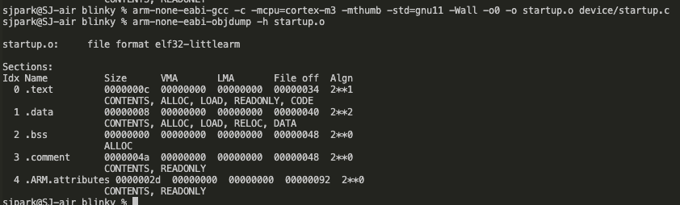
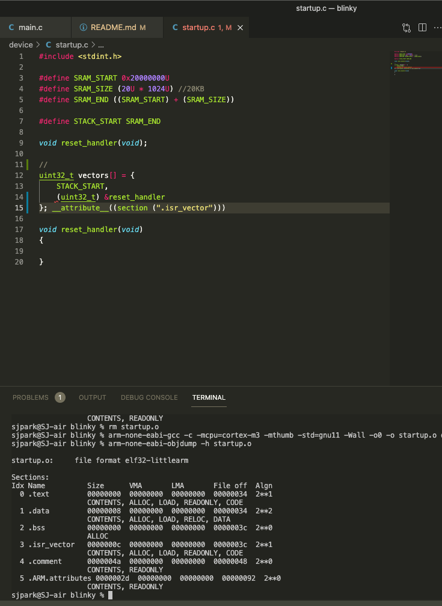

# blinky

This repository includes board bring up process and loading of blinky file

## Hardware
Description of hardware in use. [Datasheet](Docs/Datasheet.pdf) and [Reference Manual](Doc/Reference-Manual.pdf)
### MCU
STM32F103C8T6: 

- Medium-density performance 32-bit Cortex-M3 CPU
- 72 MHz
- 64 Flash memory, 20KB of SRAM

## Startup file generation
following [this](https://www.youtube.com/watch?v=2Hm8eEHsgls&ab_channel=FastbitEmbeddedBrainAcademy) tutorial.

### what is startup file?
1. The startup file is responsible for setting up the right environment for the main user code to run
2. Code written in startup file runs before main()
3. some poart of the startup code file is the target dependent
4. startup code takes care of the vector table placement in code memory as required by the ARM cortex Mx processor
5. Startup code may also take care of stack re-initialization
6. startup code is responsible of .data, .bss section initialization in main memory

### vector tables
can be found in the reference manual interrupt section. The table will have brief description and address of each IQRs. The first 15 addresses are reserved for the ARM systemic sections.

When code is built without vaiable attribute for the vector table, the table is placed in data section. we would like to use compiler attribute to create a dedicated section for the table. Refer to [this](https://gcc.gnu.org/onlinedocs/gcc/Common-Variable-Attributes.html#Common-Variable-Attributes) link and search for sections for more information. This image shows the vector table in data section. 

this picture is where section attribute is used for vector table section

There are 50+ exceptions, but you don't have to write exception handlers for all the exceptions, if you are not handling all of the exceptions. A single default handler can be used for all exceptions. Allow programmer to implement required handlers as per application requirements. This can be acheived by using GCC function attributes __weak__ and __alias__ .

1. Weak allows programmer to override already defined weak function (dummy) with the same function name
   - programmer can override the function in the main file by using the same name
2. Alias allows programmer to give alias name for a function