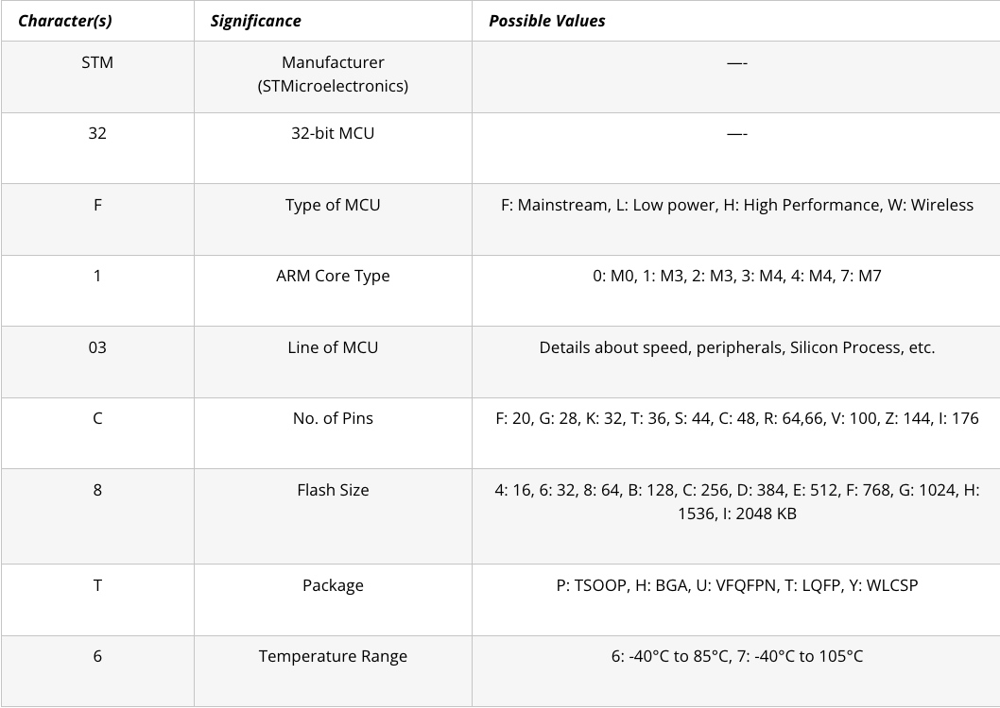

# blinky

This repository includes board bring up process and loading of blinky file

## Hardware
Description of hardware in use. [Datasheet](Docs/Datasheet.pdf) and [Reference Manual](Doc/Reference-Manual.pdf)
### MCU
STM32F103C8T6: 

- Medium-density performance 32-bit Cortex-M3 CPU
- 72 MHz
- 64 Flash memory, 20KB of SRAM

## Startup file generation
following [this](https://www.youtube.com/watch?v=2Hm8eEHsgls&ab_channel=FastbitEmbeddedBrainAcademy) tutorial.